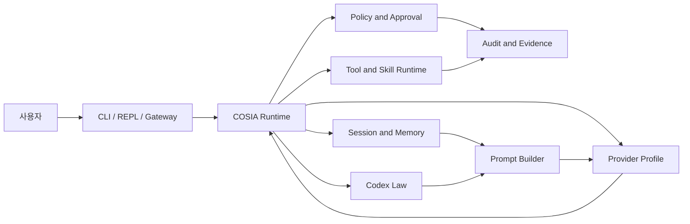

# COSIA

> 사용자가 수정할 수 있는 Codex 운영 규칙을 중심으로 동작하는 프로바이더 중립형 자기개선 에이전트 런타임

| 구분 | 내용 |
| --- | --- |
| 프로젝트 형태 | 로컬 우선 CLI 및 에이전틱 런타임 / 비공개 저장소 |
| 현재 버전 | v0.75.0 |
| 주요 작업 | 제품 정의, 런타임 아키텍처, 정책·승인 시스템, 기억·도구 성장 구조, CLI 및 Gateway 구현 |
| 기술 | TypeScript, Node.js, Commander, Zod, SQLite, Vitest |

## 한 줄 소개

COSIA는 모델을 교체 가능한 두뇌로 두고, 사용자의 세션과 장기 기억, 운영 규칙,
승인 기록, 도구 이력과 외부 연결 상태를 워크스페이스가 직접 소유하도록 설계한
로컬 에이전트 런타임입니다.

COSIA는 Codex CLI를 복제하거나 특정 모델에 종속되는 제품이 아닙니다. 여기서
Codex-Oriented란 OpenAI Codex 제품을 뜻하는 것이 아니라, 사용자가 읽고 수정할
수 있는 워크스페이스 소유의 운영 헌법을 중심으로 런타임이 동작한다는 뜻입니다.

## 만들게 된 이유

AI를 장기 프로젝트에 사용하면 대화 기록과 규칙, 기억, 승인 이력, 익숙해진 작업
방식이 특정 모델이나 채팅 서비스 안에 갇히기 쉽습니다. 모델 또는 제공자를
바꾸는 순간 프로젝트의 맥락과 운영 방식도 함께 사라집니다.

COSIA는 모델 바깥에 다음 자산을 남기는 방식으로 이 문제를 풀고자 했습니다.

- 워크스페이스가 소유하는 세션과 장기 기억
- 사용자가 직접 검토하고 수정할 수 있는 Codex 운영 규칙
- 프로바이더를 바꿔도 유지되는 정책, 승인, 연결 상태
- 반복 작업을 검토 가능한 스킬과 로컬 도구로 발전시키는 이력
- 실패와 거절까지 포함해 판단 근거를 보존하는 증거 기록

## 핵심 사용자 경험

1. 사용자가 워크스페이스를 초기화하고 모델 프로바이더 프로필을 선택합니다.
2. COSIA가 현재 세션, 요약, 장기 기억, Codex 규칙을 예산 안에서 조립합니다.
3. 선택한 모델이 답변하거나 읽기, 검색, 쓰기, shell 요청 같은 다음 행동을
   제안합니다.
4. Runtime이 도구 입력과 정책을 검증하고 허용된 행동만 실행합니다.
5. 위험하거나 시스템 경계를 바꾸는 행동은 preview와 명시적 승인을 요구합니다.
6. 실행 결과, 정책 판단, prompt 구성, 승인 근거가 세션 이력에 기록됩니다.
7. 반복해서 성공한 작업은 검토와 테스트를 거쳐 재사용 가능한 스킬 또는 로컬
   도구 후보로 발전시킬 수 있습니다.

## 아키텍처



### Codex Law

Codex는 보안, 정책, 작업 규칙, 에이전트 스타일과 사용자 선호를 담는 운영
헌법입니다. 사람이 읽고 수정할 수 있지만, Markdown 문구에 대한 모델의 순종을
보안 경계로 간주하지 않습니다.

Codex는 무엇이 참이어야 하는지를 정의하고, Policy Engine과 승인 게이트,
경로 제한, 도구 노출 필터와 감사 기록이 실제로 지켜져야 하는 경계를
결정론적으로 집행합니다.

### Provider Profiles

모델은 교체 가능한 두뇌입니다. 현재 OpenAI Codex OAuth를 사용하는 first-class
provider 경로와 OpenRouter, OpenAI-compatible profile, 기존 Codex CLI 로그인을
사용하는 compatibility 경로, 회귀 테스트용 mock provider를 구분합니다.

프로바이더가 바뀌어도 세션과 기억, 정책, Gateway 상태, 승인 이력은 COSIA에
남습니다. 각 모델의 구조화 출력 품질과 도구 호출 능력 차이는 adapter의 검증,
retry와 오류 분류로 흡수합니다.

### Session and Memory Runtime

연속성을 하나의 대화 로그로 뭉치지 않고 네 층으로 분리했습니다.

- Session context: 최근 작업 흐름
- Session summary: 오래된 맥락을 압축한 연속성
- Long-term memory: 검토를 거쳐 유지되는 사실, 결정과 선호
- Debug records: 마지막 요청과 prompt를 확인하는 진단 자료

장기 기억은 SQLite에 보관하고 core, agent, session 소유 범위를 분리합니다.
새 기억은 자동으로 진실이 되지 않으며 candidate 검토, 충돌 확인, 승격과 되돌리기
이력을 거칩니다.

### Policy and Approval Runtime

COSIA는 모든 기능을 항상 차단하거나 모든 행동을 자동화하는 방식 대신,
정책에 따른 위임과 승인을 사용합니다.

- 저위험 작업은 활성 workspace policy 안에서 위임할 수 있습니다.
- 고위험 작업과 시스템 경계 변경은 명시적 승인을 요구합니다.
- Codex 보호 파일은 일반 파일 쓰기가 아닌 전용 amendment 흐름을 사용합니다.
- hard-deny 행동은 일반 승인만으로 우회할 수 없습니다.
- 승인과 거절, 만료, 실행 결과는 근거와 함께 기록됩니다.

### Tool and Skill Runtime

반복 작업을 바로 실행 가능한 도구로 자동 등록하지 않습니다. 요청에서
capability를 조사하고, 계획과 후보를 만들고, 명시적 테스트와 승인을 거쳐
활성화하는 단계형 성장 구조를 사용합니다.

```text
반복 작업 요청
→ workspace capability scan
→ 추상 capability proposal
→ ToolDraft와 ToolCandidate
→ 명시적 테스트
→ 사용자 승인과 활성화
→ 실행 증거 축적 또는 비활성화
```

활성 도구는 고정 실행 파일과 고정 인자, workspace cwd, timeout, 출력 제한,
감사와 redaction 조건을 가집니다. 성공한 도구의 패턴은 이후 후보 생성을 돕는
blueprint가 될 수 있지만 자동으로 실행 권한을 얻지는 않습니다.

### Connector and Gateway Runtime

Telegram 같은 외부 표면은 모델 프로바이더를 소유하지 않는 선택적 connector로
취급합니다. 외부 메시지는 connector-neutral Activity와 TurnContext로 정규화되고,
사용자와 채팅 권한을 확인한 뒤 세션별 실행 queue로 전달됩니다.

자연어로 승인 의사를 표현하는 것만으로 변경이 적용되지는 않습니다. CLI의
apply 명령이나 Gateway의 명시적 apply 동작이 구체적인 pending approval을
대상으로 해야 합니다.

## 주요 기술적 과제와 해결

### 1. 모델을 바꿔도 유지되는 연속성

모델 자체의 대화 기억에 의존하면 제공자 전환과 인증 실패, 모델 교체 시 작업
맥락을 잃습니다. COSIA가 세션, 요약, 장기 기억과 prompt manifest를 직접
소유하고, 선택한 provider에는 필요한 범위만 조립해 전달하도록 분리했습니다.

이 구조에서 provider는 현재 요청을 처리하는 두뇌이지만, 프로젝트의 정체성과
기억을 소유하지 않습니다.

### 2. 사람이 읽는 규칙과 실제 권한 집행의 분리

Codex 문서는 제품의 중요한 운영 규칙이지만 prompt 문구만으로 파일, shell,
외부 전송 권한을 통제할 수는 없습니다. Codex의 정책 의도를 deterministic
Policy Engine, approval gate, filesystem boundary와 연결해 규칙과 실행 권한을
분리했습니다.

따라서 모델이 규칙을 잘못 해석하거나 악의적인 입력을 받아도 protected Codex
수정, secret 승격, 승인 없는 외부 전송 같은 hard-deny 경계는 별도로 유지됩니다.

### 3. 기억을 많이 저장하는 것보다 정확하게 유지하기

대화에서 발견된 내용을 전부 장기 기억으로 자동 저장하면 중복, 충돌, 비밀정보와
오래된 판단이 누적됩니다. candidate-first promotion을 적용해 기억의 중요도와
신뢰도, 최신성, 소유 범위를 기록하고 충돌을 해결한 뒤에만 durable memory로
승격하도록 했습니다.

승격된 기억도 archive와 promotion revert를 통해 추적 가능하게 되돌릴 수 있습니다.

### 4. 자기개선을 무제한 자기수정과 분리하기

COSIA의 자기개선은 실행 코드를 몰래 만드는 자동화가 아닙니다. 반복해서 필요한
작업을 candidate로 구조화하고, 테스트 결과와 content hash를 확인한 뒤 사용자가
활성화하는 governed growth입니다.

후보 생성, 테스트, 승인, 활성화, 거절과 비활성화 기록을 남겨 무엇이 왜 새로운
역량이 되었는지 검토할 수 있도록 했습니다.

### 5. 관찰이 실제 작업 예산을 고갈시키지 않게 하기

에이전트가 읽기와 검색을 반복하면 도구 호출 한도를 모두 사용해 실제 쓰기나
검증 작업을 수행하지 못할 수 있습니다. 단일 tool-call budget을 observation,
action, repair, verification lane으로 분리해 관찰 루프가 행동 예산을 소모하지
못하도록 구성했습니다.

### 6. 복잡한 내부 구조를 가벼운 CLI 경험으로 감추기

내부에는 기억 승격, policy audit, tool candidate, prompt manifest 같은 많은
상태가 있지만, 일반 사용자가 매번 이를 직접 관리하게 만들지 않았습니다.
status, start, chat, pending, apply, doctor를 중심으로 정상 사용 경로를 압축하고,
상세 상태는 문제 해결과 governance가 필요할 때만 노출합니다.

## 신뢰성과 안전을 위해 적용한 원칙

- workspace 밖 파일 쓰기를 막는 경로 경계
- Codex 보호 파일을 위한 별도 amendment 흐름
- secret을 private 설정 또는 명시적 환경 변수로 분리
- OAuth token과 API key의 출력 및 기억·스킬 승격 차단
- shell 요청의 preview-only 기본 동작과 일회성 승인
- 위험한 외부 전송과 Gateway shell 실행의 기본 차단
- typed schema 검증과 잘못된 AgentStep의 제한된 재시도
- prompt와 tool output의 크기 예산 및 명시적 truncation
- 승인, 정책 판단, prompt 구성, 도구 활성화의 감사 기록
- candidate와 실행 증거에 대한 hash 기반 stale 검출

## 검증 방식

TypeScript typecheck와 Vitest 회귀 테스트를 기본 검증 경로로 사용합니다.
테스트는 다음과 같은 경계를 다룹니다.

- provider profile, OAuth와 secret 처리
- session context, summary, memory promotion과 rollback
- Policy Engine, Codex amendment와 approval lifecycle
- workspace 파일 경계와 shell preview
- tool candidate 생성, 테스트, 활성화와 비활성화
- prompt budget, structured output validation과 retry
- Gateway authorization, queue, restart recovery와 connector 정규화
- CLI command 등록과 사용자 경로 회귀

mock provider는 결정론적 회귀 검증에만 사용합니다. 실제 provider 동작을 검증할
때는 별도 profile check와 명시적인 실사용 검증을 구분해, mock 성공을 실제 모델
호환성의 증거로 과장하지 않습니다.

## 현재 구현 상태

### 구현됨

- TypeScript 기반 CLI 및 guided start, chat, status, doctor 흐름
- OpenAI Codex OAuth, OpenRouter, OpenAI-compatible provider profile
- Codex CLI compatibility provider와 deterministic mock provider
- session context, summary, SQLite 장기 기억과 계층별 소유권
- Codex policy, audit, amendment preview와 명시적 apply
- capability scan부터 candidate test와 tool activation까지의 Tool Growth 흐름
- 전역 skill toolbox와 agent별 preference, block, weight
- Telegram Gateway와 권한, queue, 재시작 복구 구조
- prompt manifest, debug record, 오류 reason code와 다음 행동 안내

### 현재 한계와 방향

- 현재 주 사용 표면은 CLI와 REPL이며 전용 TUI는 향후 판단 항목입니다.
- provider-neutral 구조라도 모델별 structured output과 도구 사용 능력에는 차이가
  있으므로 profile별 실제 검증이 필요합니다.
- Approved Shell Bridge는 과도기 구조이며 장기적으로 typed command 분류와 probe,
  candidate test를 포함한 Governed Terminal을 지향합니다.
- 자동 기억 요약과 오래된 context 정리는 명시적 흐름을 충분히 검증한 뒤에만
  확대할 예정입니다.
- 자기개선은 candidate-first이며 사용자 승인 없이 실행 역량을 자동 활성화하지
  않습니다.

## 프로젝트를 통해 확인한 것

### 제품의 연속성은 모델이 아니라 런타임이 소유해야 한다

프로바이더를 자유롭게 바꾸려면 API adapter만 교체해서는 부족합니다. 세션,
기억, 정책, connector, 승인과 도구 이력까지 모델 바깥에 남아야 실제로 provider
neutral한 제품이 됩니다.

### 자연어 규칙은 운영 의도를 설명하지만 권한을 집행하지 않는다

사용자가 수정할 수 있는 Codex는 중요한 제품 표면이지만, 안전성은 deterministic
runtime gate가 담당해야 합니다. 문서와 코드의 책임을 분리하면서도 audit과
repair를 통해 둘의 불일치를 발견할 수 있어야 합니다.

### 자기개선의 핵심은 생성보다 승격 과정이다

새 기억, 스킬과 도구를 만드는 것보다 어떤 근거로 검토하고 테스트했으며 언제
활성화하거나 되돌렸는지를 보존하는 편이 더 중요했습니다. 이력 없는 자동화보다
증거가 남는 느린 성장이 장기 프로젝트에 적합하다고 판단했습니다.

### 가벼운 UX와 강한 governance는 공존할 수 있다

정책과 증거 시스템이 복잡하더라도 일상 사용 경로는 start, chat, pending,
apply 같은 소수의 동작으로 유지할 수 있습니다. 내부 안전 구조를 그대로
사용자 인터페이스에 노출하지 않는 것도 아키텍처의 책임입니다.

## 공개 범위

저장소에는 제품 코드, 개발 과정의 상세 기록, 로컬 실행 증거와 아직 정리 중인
설계 자료가 포함되어 있어 전체 저장소는 공개하지 않습니다. 이 문서는 외부
공개가 가능한 범위에서 제품 목적, 설계와 구현 범위, 기술적 판단, 검증 방식과
현재 한계를 정리한 포트폴리오용 기술 사례입니다.

기술 검토가 필요한 경우 이메일로 문의해 주시면 데모 또는 제한적인 저장소
열람 방법을 안내해 드리겠습니다.

